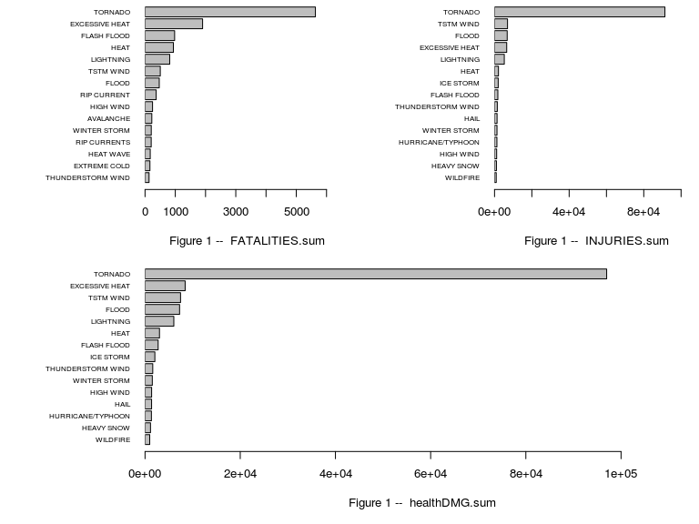
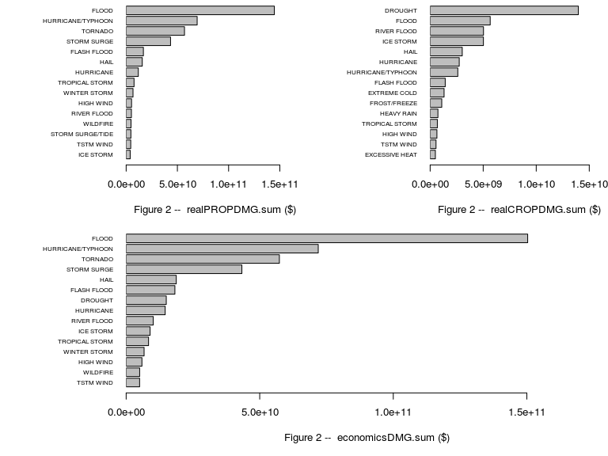

# Statistical analysis of cost caused by storms and severe weather events
Yefu Wang  
April 13th, 2017  


## Synopsis

Leave in blank in purpose right now.

## Introduction
Storms and other severe weather events can cause both public health and economic problems for communities and municipalities. Many severe events can result in fatalities, injuries, and property damage, and preventing such outcomes to the extent possible is a key concern.

This project involves exploring the U.S. National Oceanic and Atmospheric Administration's (NOAA) storm database. This database tracks characteristics of major storms and weather events in the United States, including when and where they occur, as well as estimates of any fatalities, injuries, and property damage.

### Data Processing

The data for this assignment come in the form of a comma-separated-value file compressed via the bzip2 algorithm to reduce its size. You can download the file from the following website:  

https://d396qusza40orc.cloudfront.net/repdata%2Fdata%2FStormData.csv.bz2  

There is also some documentation of the database available. Here you will find how some of th"+","-","?"e variables are constructed/defined.  

https://d396qusza40orc.cloudfront.net/repdata%2Fpeer2_doc%2Fpd01016005curr.pdf  
https://d396qusza40orc.cloudfront.net/repdata%2Fpeer2_doc%2FNCDC%20Storm%20Events-FAQ%20Page.pdf  

Let's take a look at the data first. Please be patient if this is the first for you to load the data, it might take a while. 


```r
if (!file.exists("Storm_Data.bz2")){
    download.file("https://d396qusza40orc.cloudfront.net/repdata%2Fdata%2FStormData.csv.bz2", destfile = "Storm_Data.bz2")
}

if (!exists("rawData")){
    rawData <- read.csv("Storm_Data.bz2", stringsAsFactors = FALSE)
}
```

The extracted csv file is assigned to a data frame called "rawData". Let's take a quick view what the data frame contains:


```r
colnames(rawData)
```

```
##  [1] "STATE__"    "BGN_DATE"   "BGN_TIME"   "TIME_ZONE"  "COUNTY"    
##  [6] "COUNTYNAME" "STATE"      "EVTYPE"     "BGN_RANGE"  "BGN_AZI"   
## [11] "BGN_LOCATI" "END_DATE"   "END_TIME"   "COUNTY_END" "COUNTYENDN"
## [16] "END_RANGE"  "END_AZI"    "END_LOCATI" "LENGTH"     "WIDTH"     
## [21] "F"          "MAG"        "FATALITIES" "INJURIES"   "PROPDMG"   
## [26] "PROPDMGEXP" "CROPDMG"    "CROPDMGEXP" "WFO"        "STATEOFFIC"
## [31] "ZONENAMES"  "LATITUDE"   "LONGITUDE"  "LATITUDE_E" "LONGITUDE_"
## [36] "REMARKS"    "REFNUM"
```
In particular, we found that the forealCROPDMG.sumllowing columns might be of our interest:  
1. "EVTYPE"  
2. "FATALITIES"  
3. "INJURIES"  
4. "PROPDMG"  
5. "PROPDMGEXP"  
6. "CROPDMG"  
7. "CROPDMGEXP"  realCROPDMG.sum

So, let's take the part of interest in the rawData, and assign it as DataROI.

```r
    columnsROI <- c("EVTYPE","FATALITIES","INJURIES","PROPDMG","PROPDMGEXP","CROPDMG","CROPDMGEXP")
    DataROI <- rawData[,columnsROI]
```

Before we tidy the DataROI, let's have a quick review what the DataROI looks like.


```r
    summary(DataROI)
```

```
##     EVTYPE            FATALITIES          INJURIES        
##  Length:902297      Min.   :  0.0000   Min.   :   0.0000  
##  Class :character   1st Qu.:  0.0000   1st Qu.:   0.0000  
##  Mode  :character   Median :  0.0000   Median :   0.0000  
##                     Mean   :  0.0168   Mean   :   0.1557  
##                     3rd Qu.:  0.0000   3rd Qu.:   0.0000  
##                     Max.   :583.0000   Max.   :1700.0000  
##     PROPDMG         PROPDMGEXP           CROPDMG         CROPDMGEXP       
##  Min.   :   0.00   Length:902297      Min.   :  0.000   Length:902297     
##  1st Qu.:   0.00   Class :character   1st Qu.:  0.000   Class :character  
##  Median :   0.00   Mode  :character   Median :  0.000   Mode  :character  
##  Mean   :  12.06                      Mean   :  1.527                     
##  3rd Qu.:   0.50                      3rd Qu.:  0.000                     
##  Max.   :5000.00                      Max.   :990.000
```

Here are the steps used to clean the data:
A. Fill all the NAs in the DataROI with 0
B. For "EVTYPE" variable, standardize the event types to be insensitive of upper or lower cases.
C. For the "PROPDMGEXP" and "CROPDMGEXP" variables, the "", "+", "-", "?" symbols should be replaced by "0". The numeric values should be kept the same. The letters should be replaced:  H or h = hundred(2), K or k = thousand(3), M or m = million(6), B or b = billion(9). 
D. Set the NAs in the DataROI as 0
E. Set all the values in columns of "FATALITIES", "INJURIES", "PROPDMG","PROPDMGEXP","CROPDMG","CROPDMGEXP" as numerical values


```r
    DataROI[is.na(DataROI)] <- 0
    DataROI$EVTYPE <- toupper(DataROI$EVTYPE)
    DataROI$PROPDMGEXP <- replace(DataROI$PROPDMGEXP, DataROI$PROPDMGEXP %in% c("","+","-","?"), 0)
    DataROI$CROPDMGEXP <- replace(DataROI$CROPDMGEXP, DataROI$CROPDMGEXP %in% c("","+","-","?"), 0)
    
    DataROI$PROPDMGEXP <- replace(DataROI$PROPDMGEXP, toupper(DataROI$PROPDMGEXP) == "H", 2)
    DataROI$PROPDMGEXP <- replace(DataROI$PROPDMGEXP, toupper(DataROI$PROPDMGEXP) == "K", 3)
    DataROI$PROPDMGEXP <- replace(DataROI$PROPDMGEXP, toupper(DataROI$PROPDMGEXP) == "M", 6)
    DataROI$PROPDMGEXP <- replace(DataROI$PROPDMGEXP, toupper(DataROI$PROPDMGEXP) == "B", 9)
    
    DataROI$CROPDMGEXP <- replace(DataROI$CROPDMGEXP, toupper(DataROI$CROPDMGEXP) == "H", 2)
    DataROI$CROPDMGEXP <- replace(DataROI$CROPDMGEXP, toupper(DataROI$CROPDMGEXP) == "K", 3)
    DataROI$CROPDMGEXP <- replace(DataROI$CROPDMGEXP, toupper(DataROI$CROPDMGEXP) == "M", 6)
    DataROI$CROPDMGEXP <- replace(DataROI$CROPDMGEXP, toupper(DataROI$CROPDMGEXP) == "B", 9)

    DataROI$FATALITIES <- as.numeric(DataROI$FATALITIES)
    DataROI$INJURIES <- as.numeric(DataROI$INJURIES)
    DataROI$PROPDMG <- as.numeric(DataROI$PROPDMG)
    DataROI$PROPDMGEXP <- as.numeric(DataROI$PROPDMGEXP)
    DataROI$CROPDMG <- as.numeric(DataROI$CROPDMG)
    DataROI$CROPDMGEXP <- as.numeric(DataROI$CROPDMGEXP)
```

Until this moment, the data is tidy and clean.   
We need to add some more columns as following:
A: The summation of "FATALITIES" and "INJURIES" = healthDMG
B: The realPROPDMG = PROPDMG * PROPDMGEXP
C: The realCROPDMG = CROPDMG * CROPDMGEXP
D: The economicsDMG = realPROPDMG + realCROPDMG


```r
healthDMG <- DataROI$FATALITIES + DataROI$INJURIES
realPROPDMG <- DataROI$PROPDMG * 10^(DataROI$PROPDMGEXP)
realCROPDMG <- DataROI$CROPDMG * 10^(DataROI$CROPDMGEXP)
economicsDMG <- realPROPDMG + realCROPDMG
DataROI <- cbind(DataROI, healthDMG, realPROPDMG,realCROPDMG,economicsDMG)
```

Then, for each given type of events, the following variables can be obtained:healthDMG.sum
A: The list of events (ordered)
B: Total summation of "FATALITIES"
C: Total summation of "INJURIES"
D: Total summation of "healthDMG"
E: Total summation of "realPROPDMG"
F: Total summation of "realCROPDMG"
G: total summation of "economicsDMG"

Finally, make all these columns of data into a finalTable for showing the results. 


```r
    EVENT <- as.character(sort(unique(DataROI$EVTYPE)))
    FATALITIES.sum <- tapply(DataROI$FATALITIES,DataROI$EVTYPE,sum)
    INJURIES.sum <- tapply(DataROI$INJURIES,DataROI$EVTYPE,sum)
    healthDMG.sum <- tapply(DataROI$healthDMG,DataROI$EVTYPE,sum)
    realPROPDMG.sum <- tapply(DataROI$realPROPDMG,DataROI$EVTYPE,sum)
    realCROPDMG.sum <- tapply(DataROI$realCROPDMG,DataROI$EVTYPE,sum)
    economicsDMG.sum <- tapply(DataROI$economicsDMG,DataROI$EVTYPE,sum)
    finalTable <- data.frame(EVENT,FATALITIES.sum,INJURIES.sum,healthDMG.sum,realPROPDMG.sum,realCROPDMG.sum,economicsDMG.sum)
```
### Results

Based on the finalTalbe obtained in the previous section, the analysis about the damage to both population health and economics can be carried out.   
First of all, for the "FATALITIST.sum", we can list the top 15 events that have largest values of "FATALITIST.sum", as shown in the top left one of Figure 1. Similarly, the "INJURIES.sum" and "healthDMG.sum" are shown in Figure 1.


```r
    layout(matrix(c(1,2,3,3),2,2,byrow = TRUE))
    par(mar = c(5,10,0,0))
    for (item in c("FATALITIES.sum","INJURIES.sum","healthDMG.sum")){
        temp <- finalTable[order(finalTable[,item],decreasing = TRUE),]
        temp <- temp[15:1,]
        barplot(temp[,item],names.arg = temp$EVENT, horiz = TRUE, las = 1, cex.names = 0.6, xpd = FALSE, xlim = c(0, max(temp[,item])*1.2), xlab = paste("Figure 1 -- ", item))
    }    
```

<!-- -->

From this figure, we can tell that "TORNADO" is the most harmful event for causing "Fatalities", "Injuries", and consequent the summation of both. 

Similarly, we can plot Figure 2 to show the TOP15 events that cause the most harmness to economics. 
realCROPDMG.sum

```r
    layout(matrix(c(1,2,3,3),2,2,byrow = TRUE))
    par(mar = c(5,10,0,0))
    for (item in c("realPROPDMG.sum","realCROPDMG.sum","economicsDMG.sum")){
        temp <- finalTable[order(finalTable[,item],decreasing = TRUE),]
        temp <- temp[15:1,]
        barplot(temp[,item],names.arg = temp$EVENT, horiz = TRUE, las = 1, cex.names = 0.6, xpd = FALSE, xlim = c(0, max(temp[,item])*1.2), xlab = paste("Figure 2 -- ", item, "($)"))
    }    
```

<!-- -->

As we can see in Figure 2, the most harmful event for the properties is "FLOOD", while the event "DROUGHT" is most harmful for crops. And, in total, the event "FLOOD" is most harmful for the economics. 

Please note, there is a very important step not quite clear in the data processing: 
When handling with the factors in "PROPDMGEXP" and "CROPDMGEXP", there are many values of " ", "+", "-", "?". In this report, they were considered as "0", so the corresponding values in "PROPDMG" and "CROPDMG" columns will be kept. In addition, for the other values of "0", "1", "2", "3", "4", "5", "6", "7", "8", they were remaining the same.   

It will not be surprising at all that the final conclusion could be different if different strategies were carried out to handle with the special variables in the "PROPDMGEXP" and "CROPDMGEXP" columns. 
